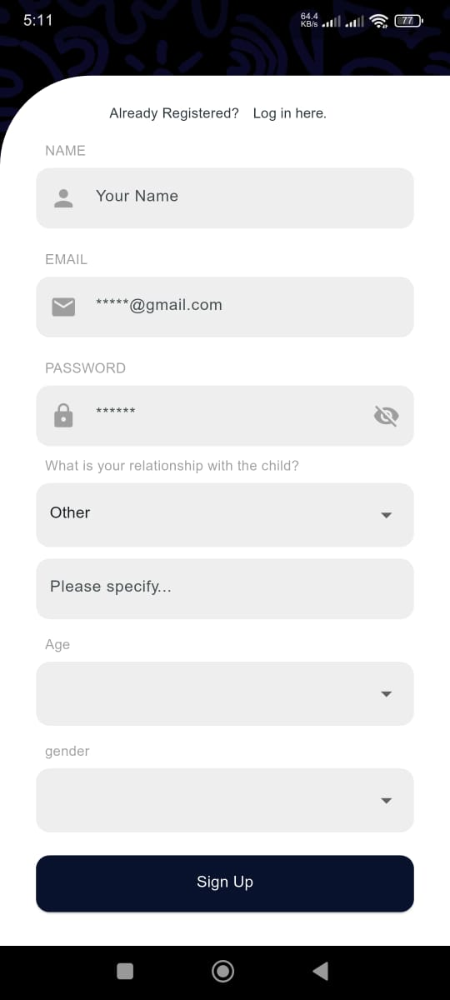
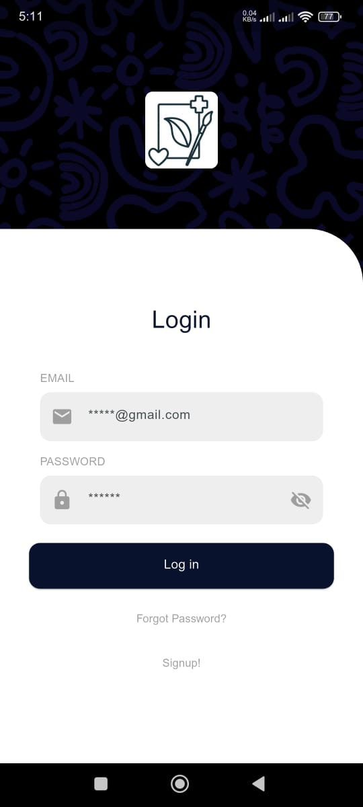
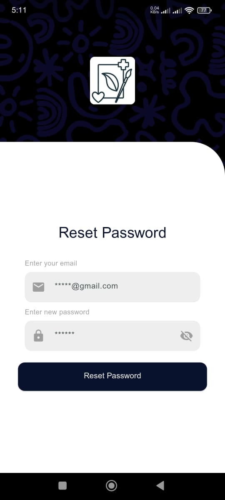
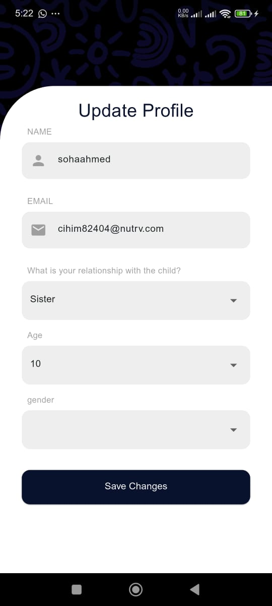
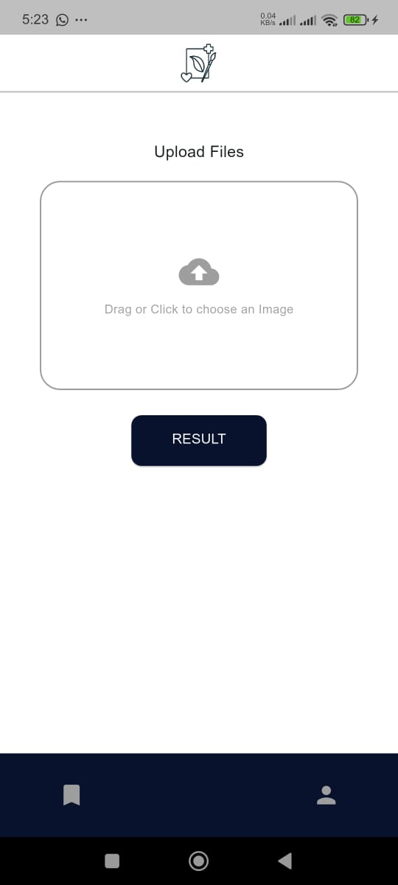
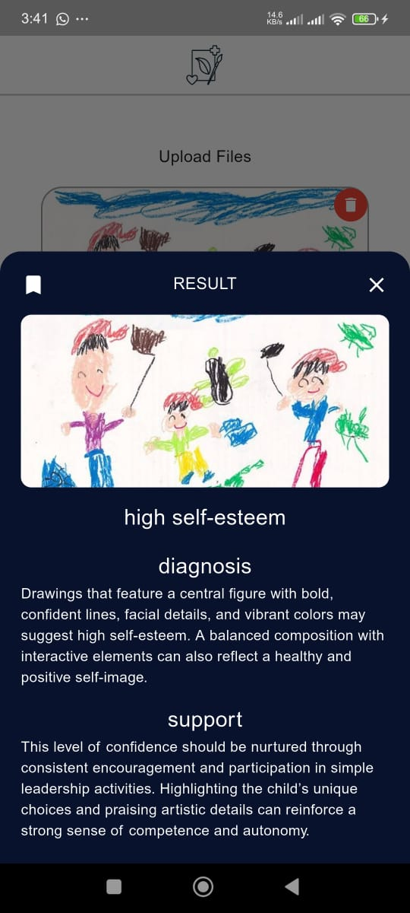
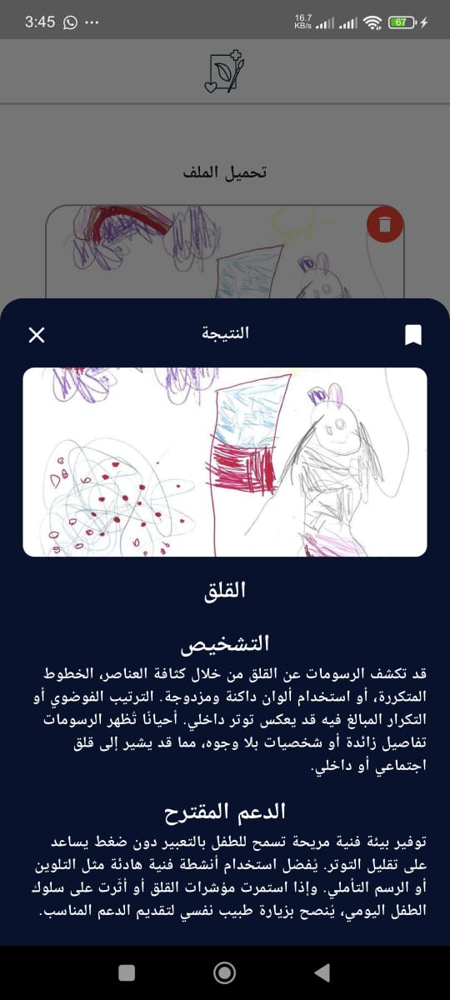
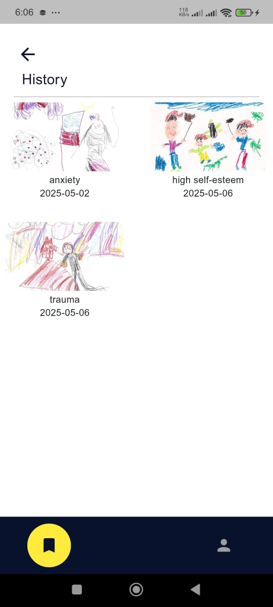
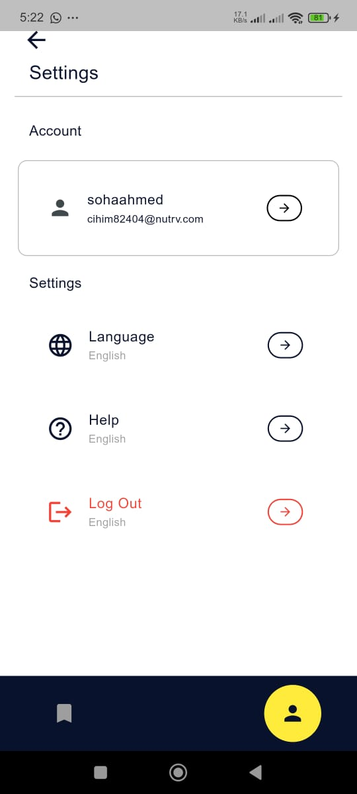

# 🎨 Art Therapy - Child Mental Health Analysis App

An AI-powered mobile application that analyzes children's drawings to detect potential mental health indicators and provide therapeutic support recommendations.


---

## 🧭 Overview

Art Therapy is a Flutter-based mobile application designed to assist parents, teachers, and caregivers in understanding children's mental and emotional states through art analysis. The app uses machine learning to analyze drawings uploaded by users and provides:

Prediction of potential mental health indicators
Diagnosis with detailed explanations
Support recommendations for caregivers

The application supports both English and Arabic languages and provides a comprehensive user management system with authentication, profile management, and history tracking.


---

## ✨ Features

### 🔐 **Authentication System**
- User registration with email verification (OTP)
- Secure login with JWT token management
- Password reset functionality
- Profile management (name, age, relation to child, gender)

### 🎨 **Art Analysis**
- Upload drawings via camera or gallery
- Image compression and optimization
- AI-powered mental health indicator detection
- Multi-language support (English/Arabic predictions)
- Detailed diagnosis and support recommendations

### 📊 **History & Tracking**
- Save analysis results to history
- View past analyses with timestamps
- Persistent storage of results on backend
- Grid view of historical drawings

### 🌍 **Localization**
- Full support for English and Arabic
- RTL (Right-to-Left) layout for Arabic
- Language switching in settings
- Localized API responses from ML model

### 👤 **User Profile**
- Update personal information
- Manage child relationship details
- Track analysis history per user
- Secure data storage

---


## 🛠️ Tech Stack

| Layer                | Technology     |
|----------------------|----------------|
| **Frontend**         | Flutter (Dart) |
| **State Management** | Bloc / Cubit   |
| **Backend Integration** | RESTful API - HTTP communication / ML Model API (Python/FastAPI) - AI prediction service at port 8000 /Node.js Backend (Port 3400) - User authentication and data management  |

---

## 📸 Screenshots








.
.
 


---

## 🚀 Getting Started

### 1. Clone the Repository
```bash
git clone https://github.com/soha131/Art_Therapy.git
```

### 2. Install Dependencies
```bash
flutter pub get
```

### 3. Run the App
```bash
flutter run
```

> Make sure your environment is set up with Flutter SDK.

---

## 🧩 Folder Structure

```
lib/
├── cubit/
│   ├── auth_cubit.dart        # Authentication & User Management
│   ├── auth_state.dart        # Auth states
│   ├── Art_cubit.dart         # AI Prediction Logic
│   └── Art_state.dart         # Art analysis states
├── models/
│   ├── user_model.dart        # User data structure
│   ├── result_model.dart      # Analysis result structure
│   ├── Art_model.dart         # AI prediction model
│   └── local_language.dart    # Localization helper
├── screens/
│   ├── login.dart             # Login screen
│   ├── signup.dart            # Registration screen
│   ├── upload_file.dart       # Main upload interface
│   ├── hisrory.dart           # Analysis history
│   ├── setting.dart           # User settings
│   └── update_profile.dart    # Profile editing
└── service.dart               # API service layer
│
└── main.dart
```

---


## 📅 Future Enhancements

- Implement offline mode with local caching.
- In-app notifications for recommendations.
- Export analysis reports as PDF.
- Multi-child profile support
---

## 🤝 Contributing

Contributions are welcome!  
Please open an issue or submit a pull request to help improve the project.

---

## 📄 License

This project is licensed under the **MIT License** — feel free to use and modify it.

---
